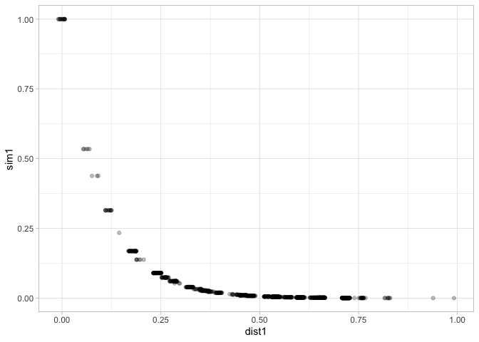

<!-- README.md is generated from README.Rmd. Please edit that file -->

# protoClassification

<!-- badges: start -->

[](https://github.com/acastroaraujo/protoClassification/actions/workflows/R-CMD-check.yaml)
<!-- badges: end -->

Install the development version of protoClassification from
[GitHub](https://github.com/) with:

``` r
# install.packages("pak")
pak::pak("acastroaraujo/protoClassification")
```


### Get Started

To simulate a dataset like the one in the Figure you need to create to
decide a couple of things first.

1.  The number of $K$ dimensions.
2.  The marginal probabilities for each dimension.
3.  A correlation matrix for the dimensions.

``` r
library(protoClassification)
set.seed(1)
K <- 6 # 1st step
marginals <- rbeta(K, 2, 2) # 2nd step
rho <- rlkjcorr(1, K, eta = 1) # 3rd step

nms <- paste0("k", 1:K)
names(marginals) <- nms
dimnames(rho) <- list(nms, nms)

round(rho, 2)
#>       k1    k2    k3    k4    k5    k6
#> k1  1.00  0.22  0.29  0.15 -0.02  0.36
#> k2  0.22  1.00 -0.08 -0.21 -0.01  0.37
#> k3  0.29 -0.08  1.00 -0.75  0.34  0.08
#> k4  0.15 -0.21 -0.75  1.00 -0.20 -0.34
#> k5 -0.02 -0.01  0.34 -0.20  1.00 -0.03
#> k6  0.36  0.37  0.08 -0.34 -0.03  1.00
round(marginals, 2)
#>   k1   k2   k3   k4   k5   k6 
#> 0.33 0.55 0.27 0.88 0.59 0.28
```

**Generate data.**

``` r
set.seed(1)
X <- make_binary_data(marginals, rho, obs = 1e3)
head(X, n = 10)
#>    k1 k2 k3 k4 k5 k6
#> 1   0  0  0  1  1  0
#> 2   1  1  1  1  1  1
#> 3   0  0  1  1  1  0
#> 4   1  1  0  1  1  0
#> 5   0  1  1  1  0  1
#> 6   1  1  0  1  0  0
#> 7   0  0  0  1  1  0
#> 8   1  1  0  1  1  1
#> 9   0  1  1  1  1  0
#> 10  1  1  0  1  1  1
```

Verify that the column means *roughly* correspond to the marginal
probabilities.

``` r
colMeans(X) |> round(2)
#>   k1   k2   k3   k4   k5   k6 
#> 0.33 0.55 0.27 0.90 0.59 0.28
```

In order to verify that the data follows the correlation structure in
`rho` you would have to calculate a “[tetrachoric
correlation](https://en.wikipedia.org/wiki/Polychoric_correlation).”

``` r
psych::tetrachoric(X)$rho |> round(2)
#>       k1    k2    k3    k4    k5    k6
#> k1  1.00  0.23  0.28  0.14 -0.01  0.40
#> k2  0.23  1.00 -0.13 -0.14  0.03  0.38
#> k3  0.28 -0.13  1.00 -0.76  0.40  0.08
#> k4  0.14 -0.14 -0.76  1.00 -0.32 -0.35
#> k5 -0.01  0.03  0.40 -0.32  1.00 -0.09
#> k6  0.40  0.38  0.08 -0.35 -0.09  1.00
```

Additional stuff for Prototype Classification Model:

- `g` (gamma) sensitivity parameter
- `w` a vector of attention weights for each k
- `P` a list of prototypes

``` r
set.seed(1)
w <- runif(K)
w <- w / sum(w)
g <- 10
```

Calculate distance and similarity for one prototype at a time:

``` r
d <- calculateDistSim(
  P = rep(1, K), 
  w = w, 
  data = X, 
  g = g
)

str(d)
#> 'data.frame':    1000 obs. of  2 variables:
#>  $ distance  : num  0.655 0 0.477 0.457 0.145 ...
#>  $ similarity: num  0.00143 1 0.00846 0.01035 0.23423 ...
```

Calculate distance, similarity, and probabilities for multiple
prototypes at the same time:

``` r
prototypes <- list(
  P1 = rep(1, K),
  P2 = rep(0, K),
  P3 = rep(1:0, K / 2)
)

out <- compute(prototypes, w, X, g = 10, r = 1)
out
#> 
#> ── Overview ──
#> 
#> ── Output:
#>  $ distance     :1000 obs. of  3 variables:
#>  $ similarity   :1000 obs. of  3 variables:
#>  $ probabilities:1000 obs. of  3 variables:
#>  $ data         :1000 obs. of  6 variables:
#> 
#> ── Prototypes:
#>  $ P1: num [1:6] 1 1 1 1 1 1
#>  $ P2: num [1:6] 0 0 0 0 0 0
#>  $ P3: int [1:6] 1 0 1 0 1 0
#> 
#> ── Attention Weights:
#>    w1    w2    w3    w4    w5    w6 
#> 0.082 0.116 0.178 0.282 0.063 0.279
#> 
#> ── Other Parameters:
#>  g  r 
#> 10  1
#> 
#> ── Marginal Probabilities (From Data):
#>    k1    k2    k3    k4    k5    k6 
#> 0.326 0.554 0.274 0.899 0.588 0.275
```

`consolidate()` the previous output into a single data frame for easier
visualization.

``` r
d <- consolidate(out)
str(d)
#> 'data.frame':    1000 obs. of  15 variables:
#>  $ prob1: num  0.0379 0.9988 0.212 0.5783 0.998 ...
#>  $ prob2: num  8.45e-01 4.53e-05 1.34e-01 2.45e-01 8.26e-04 ...
#>  $ prob3: num  0.11692 0.00115 0.65354 0.17654 0.00115 ...
#>  $ sim1 : num  0.00143 1 0.00846 0.01035 0.23423 ...
#>  $ sim2 : num  3.18e-02 4.54e-05 5.36e-03 4.39e-03 1.94e-04 ...
#>  $ sim3 : num  0.0044 0.001149 0.026083 0.003159 0.000269 ...
#>  $ dist1: num  0.655 0 0.477 0.457 0.145 ...
#>  $ dist2: num  0.345 1 0.523 0.543 0.855 ...
#>  $ dist3: num  0.543 0.677 0.365 0.576 0.822 ...
#>  $ k1   : int  0 1 0 1 0 1 0 1 0 1 ...
#>  $ k2   : int  0 1 0 1 1 1 0 1 1 1 ...
#>  $ k3   : int  0 1 1 0 1 0 0 0 1 0 ...
#>  $ k4   : int  1 1 1 1 1 1 1 1 1 1 ...
#>  $ k5   : int  1 1 1 1 0 0 1 1 1 1 ...
#>  $ k6   : int  0 1 0 0 1 0 0 1 0 1 ...

library(ggplot2)

d |> 
  ggplot(aes(dist1, sim1)) + 
  geom_jitter(height = 0, width = 1/100, alpha = 1/4) + 
  theme_light()
```



The more relevant piece of information coming from the `compute()`
function is the `.$probabilities` object.

``` r
out$probabilities |> 
  head(n = 10)
#>            P1           P2          P3
#> 1  0.03793516 8.451456e-01 0.116919205
#> 2  0.99880696 4.534577e-05 0.001147689
#> 3  0.21204400 1.344193e-01 0.653536676
#> 4  0.57832896 2.451337e-01 0.176537365
#> 5  0.99802732 8.258837e-04 0.001146794
#> 6  0.35850294 5.320625e-01 0.109434541
#> 7  0.03793516 8.451456e-01 0.116919205
#> 8  0.99726291 1.591178e-03 0.001145915
#> 9  0.73097337 4.589391e-02 0.223132720
#> 10 0.99726291 1.591178e-03 0.001145915
```

With this you can classify each row in the simulated dataset and then
get conditional probabilities for each $K$ feature.

*Deterministically:*

``` r
category <- apply(out$probabilities, 1, which.max)
lapply(split(out$data, category), colMeans)
#> $`1`
#>        k1        k2        k3        k4        k5        k6 
#> 0.6011561 0.8265896 0.3728324 0.9161850 0.6213873 0.7312139 
#> 
#> $`2`
#>        k1        k2        k3        k4        k5        k6 
#> 0.1493124 0.4774067 0.0000000 0.9705305 0.5147348 0.0216110 
#> 
#> $`3`
#>         k1         k2         k3         k4         k5         k6 
#> 0.28965517 0.17241379 1.00000000 0.60689655 0.76551724 0.07586207
```

*Probabilistically:*

``` r
category <- apply(out$probabilities, 1, \(x) {
  sample(seq_along(x), size = 1, prob = x)
})
lapply(split(out$data, category), colMeans)
#> $`1`
#>        k1        k2        k3        k4        k5        k6 
#> 0.5368421 0.7763158 0.3157895 0.9447368 0.5921053 0.6342105 
#> 
#> $`2`
#>         k1         k2         k3         k4         k5         k6 
#> 0.13063063 0.42117117 0.06531532 0.94369369 0.49549550 0.03828829 
#> 
#> $`3`
#>         k1         k2         k3         k4         k5         k6 
#> 0.36363636 0.40909091 0.71022727 0.68750000 0.81250000 0.09659091
```

Or using the `conditionalProbs()` function.

``` r
conditionalProbs(out, .sample = TRUE)
#> $`1`
#>        k1        k2        k3        k4        k5        k6 
#> 0.5352480 0.7728460 0.3315927 0.9399478 0.6240209 0.6240209 
#> 
#> $`2`
#>         k1         k2         k3         k4         k5         k6 
#> 0.12217195 0.43212670 0.07013575 0.92986425 0.46832579 0.04751131 
#> 
#> $`3`
#>         k1         k2         k3         k4         k5         k6 
#> 0.38285714 0.38285714 0.66285714 0.73142857 0.81142857 0.08571429
```

The point is to compare different probabilities across different
parameters values (i.e., compositional effects).

For example:

``` r
set.seed(1)

w_unif <- temperature(w, 5) # make weights more uniform
w_unif
#> [1] 0.1484224 0.1587893 0.1730981 0.1898107 0.1404808 0.1893986

out <- compute(prototypes, w_unif, X, g = 10, r = 1) 
colMeans(out$probabilities)
#>        P1        P2        P3 
#> 0.3756385 0.4490583 0.1753033
conditionalProbs(out, .sample = TRUE) 
#> $`1`
#>        k1        k2        k3        k4        k5        k6 
#> 0.5868946 0.8433048 0.3304843 0.9202279 0.6695157 0.5982906 
#> 
#> $`2`
#>         k1         k2         k3         k4         k5         k6 
#> 0.09251101 0.43612335 0.05947137 0.95814978 0.41189427 0.09691630 
#> 
#> $`3`
#>        k1        k2        k3        k4        k5        k6 
#> 0.4000000 0.3076923 0.6717949 0.7230769 0.8512821 0.1076923

w2 <- vector("double", length(w)) # all attention on dimension 2
w2[[2]] <- 1
w2
#> [1] 0 1 0 0 0 0

out <- compute(prototypes, w2, X, g = 10, r = 1)
colMeans(out$probabilities)
#>        P1        P2        P3 
#> 0.5539598 0.2230201 0.2230201
conditionalProbs(out, .sample = TRUE) 
#> $`1`
#>        k1        k2        k3        k4        k5        k6 
#> 0.3862816 1.0000000 0.2418773 0.8808664 0.5974729 0.3664260 
#> 
#> $`2`
#>        k1        k2        k3        k4        k5        k6 
#> 0.2434783 0.0000000 0.3652174 0.9043478 0.5478261 0.1652174 
#> 
#> $`3`
#>        k1        k2        k3        k4        k5        k6 
#> 0.2592593 0.0000000 0.2592593 0.9398148 0.6064815 0.1574074
```

To do:

- Allow `g` to vary by category.
- Figure out when “r = 1” or “r = 2” matters.
- Figure out a best way to measure compositional effects (e.g., relative
  risk ratio, difference in probabilities)
