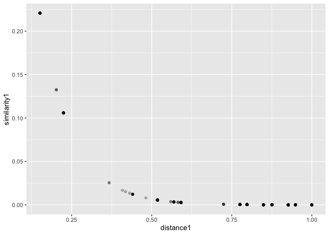
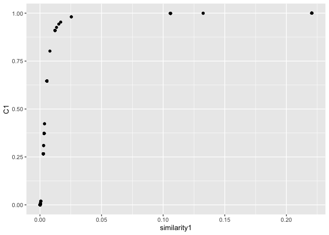
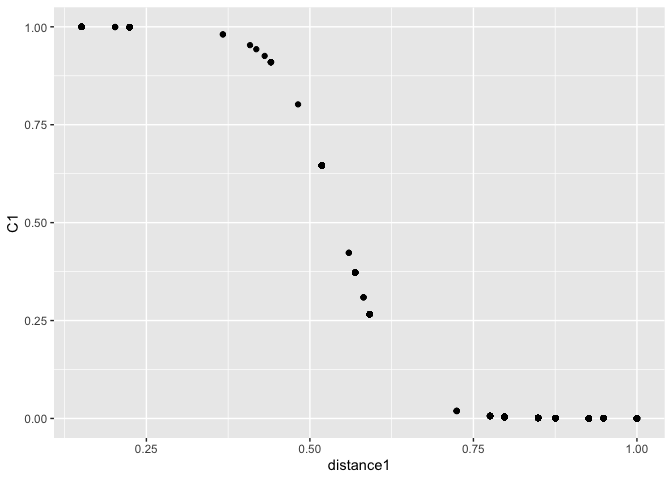
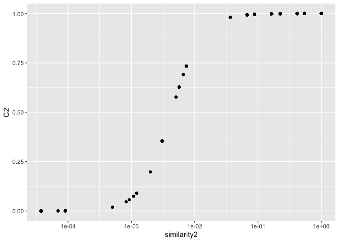

<!-- README.md is generated from README.Rmd. Please edit that file -->

# protoClassification

<!-- badges: start -->
<!-- badges: end -->

You can install the development version of protoClassification from
[GitHub](https://github.com/) with:

``` r
# install.packages("pak")
pak::pak("acastroaraujo/protoClassification")
```

Overview:


``` r
library(tidyverse)
library(protoClassification)

K <- 5
nms <- paste0("k", 1:K)
rho <- rlkjcorr(1, K, eta = 1)
marginals <- rbeta(K, 2, 3)

rownames(rho) <- nms
colnames(rho) <- nms
names(marginals) <- nms

out <- make_data(marginals, rho) 
colnames(out) <- nms
out[1:10, ]
#>       k1 k2 k3 k4 k5
#>  [1,]  1  0  0  0  0
#>  [2,]  1  1  0  1  1
#>  [3,]  1  1  0  0  1
#>  [4,]  0  0  1  0  0
#>  [5,]  1  1  0  0  0
#>  [6,]  0  0  1  0  0
#>  [7,]  0  1  0  0  1
#>  [8,]  0  0  0  0  0
#>  [9,]  0  1  0  0  0
#> [10,]  0  0  1  0  0

w <- rexp(K, rate = 3)
w <- w / sum(w)
P <- rep(1, K)

d <- calculateDS(out, w, P, g = 10) |> 
  rename_all(\(x) paste0(x, 1)) |> 
  bind_cols(as.data.frame(out))

d |> 
  ggplot(aes(distance1, similarity1)) + 
  geom_point(alpha = 1/4, position = position_jitter(width = 0))
```



``` r

P2 <- rep(0, K)
d2 <- calculateDS(out, w, P2, 12) |> 
  rename_all(\(x) paste0(x, 2))

d <- bind_cols(d, d2)

d <- d |> 
  mutate(C1 = similarity1 / (similarity1 + similarity2)) |> 
  mutate(C2 = similarity2 / (similarity1 + similarity2))

d |> 
  ggplot(aes(similarity1, C1)) + 
  geom_point()
```



``` r

d |> 
  ggplot(aes(distance1, C1)) + 
  geom_point()
```



``` r

d |> 
  ggplot(aes(similarity2, C2)) + 
  geom_point() + 
  scale_x_log10()
```



``` r

mean(round(d$C1))
#> [1] 0.16
mean(round(d$C2))
#> [1] 0.84
```
