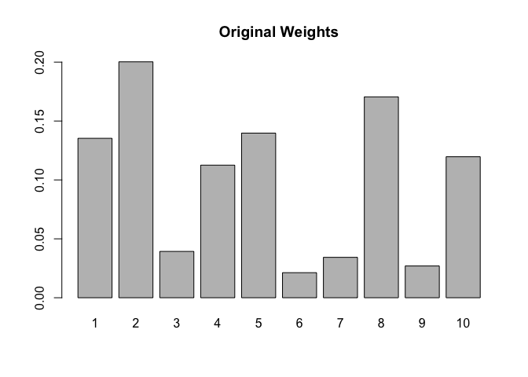

<!-- README.md is generated from README.Rmd. Please edit that file -->

# protoClassification

<!-- badges: start -->

[](https://github.com/acastroaraujo/protoClassification/actions/workflows/R-CMD-check.yaml)

<!-- badges: end -->

Install the development version of protoClassification from
[GitHub](https://github.com/) with:

``` r
# install.packages("pak")
pak::pak("acastroaraujo/protoClassification")
```

## Get Started

To simulate a dataset you need to create to decide a couple of things
first.

1.  The number of $K$ dimensions.
2.  The marginal probabilities for each dimension.
3.  A correlation matrix for the dimensions.

``` r
library(protoClassification)
set.seed(1)
K <- 6 # 1st step
marginals <- rbeta(K, 2, 2) # 2nd step
rho <- rlkjcorr(1, K, eta = 1) # 3rd step
```

**Generate data.**

``` r
set.seed(1)
sim_data <- make_binary_data(marginals, rho, obs = 1e3)
sim_data
#> 
#> ── Data ──
#> 
#> 1000 obs. of  6 variables:
#>  $ x1: int  0 1 0 1 0 1 0 1 0 1 ...
#>  $ x2: int  0 1 0 1 1 1 0 1 1 1 ...
#>  $ x3: int  0 1 1 0 1 0 0 0 1 0 ...
#>  $ x4: int  1 1 1 1 1 1 1 1 1 1 ...
#>  $ x5: int  1 1 1 1 0 0 1 1 1 1 ...
#>  $ x6: int  0 1 0 0 1 0 0 1 0 1 ...
#> 
#> ── Parameters ──
#> 
#> ── Marginal Probabilities:
#>   x1   x2   x3   x4   x5   x6 
#> 0.33 0.55 0.27 0.88 0.59 0.28
#> 
#> 
#> ── Correlation Matrix:
#>       x1    x2    x3    x4    x5    x6
#> x1  1.00  0.22  0.29  0.15 -0.02  0.36
#> x2  0.22  1.00 -0.08 -0.21 -0.01  0.37
#> x3  0.29 -0.08  1.00 -0.75  0.34  0.08
#> x4  0.15 -0.21 -0.75  1.00 -0.20 -0.34
#> x5 -0.02 -0.01  0.34 -0.20  1.00 -0.03
#> x6  0.36  0.37  0.08 -0.34 -0.03  1.00
```

*Note. The parameters are stored as the `params` attribute in the
output.*

We can verify that the column means *roughly* correspond to the marginal
probabilities.

``` r
colMeans(sim_data)
#>    x1    x2    x3    x4    x5    x6 
#> 0.326 0.554 0.274 0.899 0.588 0.275
```

In order to verify that the data follows the correlation structure in
`rho` you would have to calculate a “[tetrachoric
correlation](https://en.wikipedia.org/wiki/Polychoric_correlation).”

``` r
psych::tetrachoric(sim_data)$rho
#>             x1          x2          x3         x4          x5          x6
#> x1  1.00000000  0.23375492  0.28118697  0.1442114 -0.01192531  0.40365755
#> x2  0.23375492  1.00000000 -0.13315127 -0.1448709  0.03404136  0.38467926
#> x3  0.28118697 -0.13315127  1.00000000 -0.7612102  0.40485490  0.07792155
#> x4  0.14421140 -0.14487091 -0.76121019  1.0000000 -0.31759978 -0.34664697
#> x5 -0.01192531  0.03404136  0.40485490 -0.3175998  1.00000000 -0.08953172
#> x6  0.40365755  0.38467926  0.07792155 -0.3466470 -0.08953172  1.00000000
```

Additional stuff for Prototype Classification Model:

- `w` a vector of attention weights for each k

- `P` a list of prototypes, one per category.

- `g` (gamma) sensitivity parameter.

``` r
set.seed(1)
w <- runif(K)
w <- w / sum(w)
g <- 10
```

Calculate distance and similarity for one prototype at a time:

``` r
d <- calculateDistSim(
  P = rep(1, K), 
  w = w, 
  data = sim_data, 
  g = g
)

str(d)
#> 'data.frame':    1000 obs. of  2 variables:
#>  $ distance  : num  0.655 0 0.477 0.457 0.145 ...
#>  $ similarity: num  0.00143 1 0.00846 0.01035 0.23423 ...
```

Calculate distance, similarity, and probabilities for multiple
prototypes at the same time:

``` r
prototypes <- list(
  P1 = rep(1, K),
  P2 = rep(0, K),
  P3 = rep(1:0, K / 2)
)

g <- rep(10, 3)

out <- compute(sim_data, prototypes, w, g)
out
#> 
#> ── Output ──
#> 
#>  $ distance      1000 obs. of  3 variables
#>  $ similarity    1000 obs. of  3 variables
#>  $ probabilities 1000 obs. of  3 variables
#>  $ data          1000 obs. of  6 variables
#> 
#> ── Prototypes ──
#> 
#>  $ P1: num [1:6] 1 1 1 1 1 1
#>  $ P2: num [1:6] 0 0 0 0 0 0
#>  $ P3: int [1:6] 1 0 1 0 1 0
#> 
#> ── Distance ──
#> 
#> Manhattan (r = 1)
#> 
#> ── Sensitivity ──
#> 
#> g1 g2 g3 
#> 10 10 10
#> 
#> ── Attention Weights ──
#> 
#>    w1    w2    w3    w4    w5    w6 
#> 0.082 0.116 0.178 0.282 0.063 0.279
#> 
#> ── Marginal Probabilities ──
#> 
#> ── `colMeans(.$data)`
#>    x1    x2    x3    x4    x5    x6 
#> 0.326 0.554 0.274 0.899 0.588 0.275
#> 
#> ── `colMeans(.$probabilities)`
#>        C1        C2        C3 
#> 0.3883449 0.4360664 0.1755887
```

`consolidate()` the previous output into a single data frame for easier
visualization.

``` r
d <- consolidate(out)
str(d)
#> 'data.frame':    1000 obs. of  15 variables:
#>  $ prob1: num  0.0379 0.9988 0.212 0.5783 0.998 ...
#>  $ prob2: num  8.45e-01 4.53e-05 1.34e-01 2.45e-01 8.26e-04 ...
#>  $ prob3: num  0.11692 0.00115 0.65354 0.17654 0.00115 ...
#>  $ sim1 : num  0.00143 1 0.00846 0.01035 0.23423 ...
#>  $ sim2 : num  3.18e-02 4.54e-05 5.36e-03 4.39e-03 1.94e-04 ...
#>  $ sim3 : num  0.0044 0.001149 0.026083 0.003159 0.000269 ...
#>  $ dist1: num  0.655 0 0.477 0.457 0.145 ...
#>  $ dist2: num  0.345 1 0.523 0.543 0.855 ...
#>  $ dist3: num  0.543 0.677 0.365 0.576 0.822 ...
#>  $ x1   : int  0 1 0 1 0 1 0 1 0 1 ...
#>  $ x2   : int  0 1 0 1 1 1 0 1 1 1 ...
#>  $ x3   : int  0 1 1 0 1 0 0 0 1 0 ...
#>  $ x4   : int  1 1 1 1 1 1 1 1 1 1 ...
#>  $ x5   : int  1 1 1 1 0 0 1 1 1 1 ...
#>  $ x6   : int  0 1 0 0 1 0 0 1 0 1 ...
```

*Note. Since only binary data is implemented, there is no difference
between Manhattan and Euclidean distance!*

## Marginal and Conditional Probabilities

So far, a single simulation requires the marginal probabilities for each
element of $\mathbf{x}$ to be specified at the outset.

``` r
colMeans(out$data) # cf. `marginals` argument in `make_binary_data()`
#>    x1    x2    x3    x4    x5    x6 
#> 0.326 0.554 0.274 0.899 0.588 0.275
```

The more relevant piece of information we get from the `compute()`
function is the `.$probabilities` object, which calculates the
probability that any given individual in our simulated dataset will
belong to each of the prototype categories.

This allows us to calculate the marginal probabilities for each
category.

``` r
colMeans(out$probabilities)
#>        C1        C2        C3 
#> 0.3883449 0.4360664 0.1755887
```

With some ingenuity, we can use this information to get *conditional
probabilities* too.

$$
\Pr(X_k = 1 \mid C = c)
$$

``` r
conditionalProbs(out, "features")
#>           x1        x2         x3        x4        x5         x6
#> C1 0.5226571 0.7802353 0.32826487 0.9332301 0.6171392 0.62588499
#> C2 0.1302299 0.4297247 0.05791891 0.9465871 0.4820181 0.03806980
#> C3 0.3770770 0.3621551 0.69020964 0.7052639 0.7862111 0.08786438
```

$$
\Pr(X_k = 0 \mid C = c)
$$

``` r
1 - conditionalProbs(out, "features")
#>           x1        x2        x3         x4        x5        x6
#> C1 0.4769570 0.2200126 0.6714007 0.06717440 0.3829206 0.3734904
#> C2 0.8703417 0.5706125 0.9425701 0.05316343 0.5189671 0.9620408
#> C3 0.6227137 0.6362298 0.3103042 0.29413893 0.2117976 0.9130266
```

$$
\Pr(C = c \mid X_k)
$$

``` r
conditionalProbs(out, type = "categories")
#> $`Xk=0`
#>           C1        C2         C3
#> x1 0.2743383 0.5632908 0.16237092
#> x2 0.1926099 0.5577848 0.24960538
#> x3 0.3591157 0.5664215 0.07446281
#> x4 0.2566337 0.2286733 0.51469307
#> x5 0.3608689 0.5489563 0.09017476
#> x6 0.2001655 0.5788414 0.22099310
#> 
#> $`Xk=1`
#>           C1         C2         C3
#> x1 0.6236135 0.17344785 0.20293865
#> x2 0.5456643 0.33832130 0.11601444
#> x3 0.4652701 0.09116788 0.44356204
#> x4 0.4029833 0.45951724 0.13749944
#> x5 0.4073537 0.35719728 0.23544898
#> x6 0.8839345 0.06015273 0.05591273
```

Alternatively, it’s easier to use the `summary()` function to extract
all conditional and marginal probabilities.

``` r
probs <- summary(out)
probs
#> 
#> ── Categories ──
#> 
#> ── Marginals:
#>    C1    C2    C3 
#> 0.388 0.436 0.176
#> 
#> ── Conditionals:
#> $`Xk=0`
#>       C1    C2    C3
#> x1 0.276 0.562 0.162
#> x2 0.193 0.558 0.249
#> x3 0.360 0.565 0.075
#> x4 0.258 0.231 0.511
#> x5 0.362 0.548 0.091
#> x6 0.202 0.578 0.220
#> 
#> $`Xk=1`
#>       C1    C2    C3
#> x1 0.624 0.173 0.202
#> x2 0.548 0.337 0.116
#> x3 0.467 0.092 0.441
#> x4 0.404 0.458 0.137
#> x5 0.409 0.357 0.234
#> x6 0.884 0.060 0.056
#> 
#> ── Features ──
#> 
#> ── Marginals:
#>    x1    x2    x3    x4    x5    x6 
#> 0.326 0.554 0.274 0.899 0.588 0.275
#> 
#> ── Conditionals:
#>       x1    x2    x3    x4    x5    x6
#> C1 0.523 0.779 0.329 0.933 0.618 0.625
#> C2 0.129 0.429 0.057 0.946 0.480 0.038
#> C3 0.378 0.364 0.691 0.705 0.788 0.088
```

## Compositional Effects

Our main goal is to compare different probabilities across different
parameters values. In particular, we can measure the “compositional
effects” that result from different parameter values by keeping track of
these conditional probabilities: $\Pr(\mathbf{x} \mid C, \Omega)$, where
$\Omega$ is a short-hand way of referring to all parameters in the
prototype model.

Here I provide a few examples.

``` r
set.seed(9)
# Basic Workflow ----

K <- 10 
obs <- 1e3

# Data ----

mu <- rbeta(K, 2, 2) 
rho <- rlkjcorr(1, K, eta = 1)

sim_data <- make_binary_data(mu, rho, obs)

# Prototype Parameters ----

w <- runif(K)
w <- w / sum(w)

g <- c(10, 10)

prototypes <- list(
  P1 = rep(1, K),
  P2 = rep(0, K)
)

# Compute ----

out <- compute(sim_data, prototypes, w, g)
probs <- summary(out, s = 1e3)
```

**Changing** $\gamma$

``` r
# This should make the second category more inclusive
new_out <- compute(sim_data, prototypes, w, g = c(10, 5))
new_probs <- summary(new_out, s = 1e3)
```

This should increase the marginal probabilities of the second category.

``` r
probs$marginal$categories
#>        C1        C2 
#> 0.3467094 0.6532906
new_probs$marginal$categories
#>        C1        C2 
#> 0.1272612 0.8727388
```

And these are the compositional effects:

``` r
probs$conditional$features
#>           x1        x2        x3        x4        x5        x6        x7
#> C1 0.5728644 0.5546241 0.4564499 0.5167535 0.8871769 0.3245671 0.8346980
#> C2 0.1476666 0.1344176 0.4190103 0.4130322 0.5257202 0.1370018 0.8030352
#>           x8        x9       x10
#> C1 0.5830473 0.3673473 0.4692927
#> C2 0.4483320 0.4632084 0.3647565
new_probs$conditional$features
#>           x1        x2        x3        x4        x5        x6        x7
#> C1 0.6926339 0.7162739 0.4362536 0.5256324 0.9326090 0.3853025 0.8662932
#> C2 0.2370709 0.2164392 0.4313787 0.4378470 0.6099313 0.1753121 0.8064060
#>           x8        x9       x10
#> C1 0.6368593 0.3008669 0.4785071
#> C2 0.4743415 0.4487705 0.3897002

# diff-in-prob
new_probs$conditional$features - probs$conditional$features
#>            x1         x2          x3          x4         x5         x6
#> C1 0.11976955 0.16164978 -0.02019631 0.008878864 0.04543211 0.06073539
#> C2 0.08940431 0.08202158  0.01236839 0.024814811 0.08421110 0.03831033
#>             x7         x8          x9         x10
#> C1 0.031595164 0.05381202 -0.06648039 0.009214365
#> C2 0.003370833 0.02600956 -0.01443787 0.024943624
# risk ratio
new_probs$conditional$features / probs$conditional$features
#>          x1       x2        x3       x4       x5       x6       x7       x8
#> C1 1.209071 1.291458 0.9557535 1.017182 1.051210 1.187127 1.037852 1.092294
#> C2 1.605447 1.610200 1.0295181 1.060080 1.160182 1.279634 1.004198 1.058014
#>           x9      x10
#> C1 0.8190258 1.019635
#> C2 0.9688307 1.068384
```

**Changing the “attention weights”**

1st, we can make the attention weights more selective, meaning that
classification becomes more rule-like.

``` r
w2 <- temperature(w, temp = 1/4) # cf. "temperature sampling"
barplot(w, names.arg = seq_along(w), main = "Original Weights")
```



``` r
barplot(w2, names.arg = seq_along(w), main = "New Weights")
```


``` r

new_out <- compute(sim_data, prototypes, w = w2, g)
new_probs <- summary(new_out, s = 1e3)
```

The change in compositional effects should make it such that the new
$p(x_k \mid c)$ are very high when $x_k$ is highly weighted.

``` r
probs$conditional$features
#>           x1        x2        x3        x4        x5        x6        x7
#> C1 0.5728644 0.5546241 0.4564499 0.5167535 0.8871769 0.3245671 0.8346980
#> C2 0.1476666 0.1344176 0.4190103 0.4130322 0.5257202 0.1370018 0.8030352
#>           x8        x9       x10
#> C1 0.5830473 0.3673473 0.4692927
#> C2 0.4483320 0.4632084 0.3647565
new_probs$conditional$features
#>           x1         x2        x3        x4        x5        x6        x7
#> C1 0.4860178 0.86941998 0.3071452 0.3394442 0.7586206 0.2901795 0.9158345
#> C2 0.2139871 0.03015844 0.4849078 0.4954442 0.6053495 0.1646123 0.7708265
#>           x8        x9       x10
#> C1 0.5976563 0.2572416 0.3823109
#> C2 0.4514389 0.5032435 0.4089434

# diff-in-prob
new_probs$conditional$features - probs$conditional$features
#>             x1         x2          x3          x4          x5          x6
#> C1 -0.08684659  0.3147958 -0.14930471 -0.17730924 -0.12855632 -0.03438758
#> C2  0.06632044 -0.1042591  0.06589754  0.08241196  0.07962923  0.02761056
#>             x7          x8         x9         x10
#> C1  0.08113647 0.014608959 -0.1101057 -0.08698181
#> C2 -0.03220874 0.003106965  0.0400351  0.04418685
# risk ratio
new_probs$conditional$features / probs$conditional$features
#>           x1        x2        x3        x4        x5        x6        x7
#> C1 0.8483994 1.5675841 0.6729001 0.6568785 0.8550951 0.8940509 1.0972046
#> C2 1.4491228 0.2243638 1.1572695 1.1995291 1.1514669 1.2015343 0.9598912
#>          x8        x9       x10
#> C1 1.025056 0.7002682 0.8146534
#> C2 1.006930 1.0864300 1.1211407
```

At the extreme, when attention is placed exclusively on one feature.

We should expect $p(x_k \mid c)$ to be 1.

``` r
w2 <- vector("double", length(w)) # all attention on dimension 3
w2[[3]] <- 1
barplot(w2, names.arg = seq_along(w2))
```


``` r

new_out <- compute(sim_data, prototypes, w = w2, g)
new_probs <- summary(new_out, s = 1e3)

new_probs$conditional$features
#>           x1        x2           x3        x4        x5        x6        x7
#> C1 0.4212941 0.1689949 9.999469e-01 0.5231397 0.6712993 0.2152812 0.7314927
#> C2 0.1989426 0.3644288 2.811951e-05 0.3926105 0.6355607 0.1918985 0.8767538
#>           x8        x9       x10
#> C1 0.4097318 0.3888849 0.3842530
#> C2 0.5598537 0.4612716 0.4137375
```

Furthermore, marginal probability of $c_1$ should converge to the
marginal probability of that feature with exclusive attention.

``` r
new_probs$marginal
#> $categories
#>        C1        C2 
#> 0.4320062 0.5679938 
#> 
#> $features
#>    x1    x2    x3    x4    x5    x6    x7    x8    x9   x10 
#> 0.295 0.280 0.432 0.449 0.651 0.202 0.814 0.495 0.430 0.401
```

Compositional Effects:

``` r
# diff-in-prob
new_probs$conditional$features - probs$conditional$features
#>             x1         x2         x3           x4         x5          x6
#> C1 -0.15157026 -0.3856292  0.5434970  0.006386203 -0.2158776 -0.10928584
#> C2  0.05127596  0.2300112 -0.4189822 -0.020421740  0.1098404  0.05489672
#>             x7         x8           x9         x10
#> C1 -0.10320531 -0.1733156  0.021537656 -0.08503970
#> C2  0.07371856  0.1115218 -0.001936813  0.04898097

# risk ratio
new_probs$conditional$features / probs$conditional$features
#>           x1        x2           x3        x4        x5        x6        x7
#> C1 0.7354169 0.3047017 2.190705e+00 1.0123583 0.7566691 0.6632874 0.8763561
#> C2 1.3472414 2.7111691 6.710935e-05 0.9505565 1.2089333 1.4007008 1.0917999
#>           x8        x9       x10
#> C1 0.7027419 1.0586302 0.8187918
#> C2 1.2487482 0.9958187 1.1342840
```

## Back to Correlations

When all attention is placed on one feature, like in the previous
example, we get to see something very intuitive about the compositions
of all the other features.

If we compare

``` r
xCondC1 <- new_probs$conditional$features["C1", ]
x <- new_probs$marginal$features

xCondC1 - x ## difference from baseline marginal probability
#>          x1          x2          x3          x4          x5          x6 
#>  0.12629413 -0.11100510  0.56794688  0.07413969  0.02029934  0.01328124 
#>          x7          x8          x9         x10 
#> -0.08250726 -0.08526823 -0.04111505 -0.01674697
```

Look at the original correlation matrix:

``` r
rho <- attr(new_out$data, "params")$rho
round(rho["x3", ], 3)
#>     x1     x2     x3     x4     x5     x6     x7     x8     x9    x10 
#>  0.146 -0.422  1.000  0.269 -0.014 -0.060 -0.270 -0.204 -0.078  0.006
```

It seems like this difference from baseline is a linear function of the
correlations between the features.

``` r
d <- data.frame(corr = rho["x3", ], diff = xCondC1 - x)
plot(d)
```


This is certainly not the case when the attention weights are more
spread out.

``` r
xCondC1 <- probs$conditional$features["C1", ]
x <- probs$marginal$features
rho <- attr(out$data, "params")$rho

d <- data.frame(corr = rho["x3", ], diff = xCondC1 - x)
plot(d)
```


The mission is to find a formula that explains $p(x\mid c)$ as a
function of the simulation parameters!
